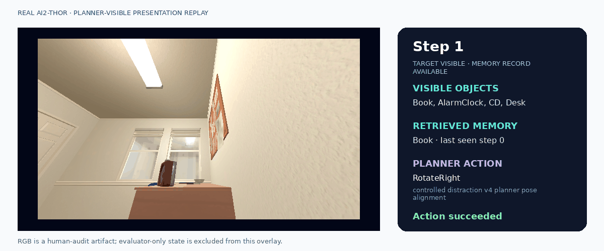
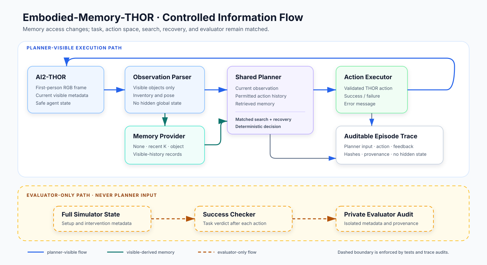
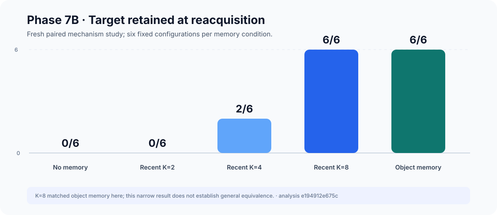

# Embodied-Memory-THOR

<p align="center">
  <strong>Controlled evaluation of persistent object memory for partially observable embodied agents in AI2-THOR.</strong>
</p>

<p align="center">
  
  
  
  
</p>

<p align="center">
  <a href="docs/report.md">Research report</a> ·
  <a href="docs/application_abstract.md">Application abstract</a> ·
  <a href="docs/phase5_formal_results.md">Phase-5 results</a> ·
  <a href="docs/phase7/README.md">Holdout evidence</a> ·
  <a href="docs/USAGE.md">Usage &amp; reproduction</a>
</p>

<p align="center">
  
</p>

<p align="center">
  <sub>Real AI2-THOR presentation replay: visible objects, retrieved memory, planner action, and action result are composed from saved RGB frames and the planner-visible trace. It is an explanatory replay, not a formal comparison row; evaluator-only state is excluded. <a href="docs/assets/readme/demo_manifest.json">Provenance manifest</a>.</sub>
</p>

## Research snapshot

| Study | Controlled design | Executions | Main descriptive result |
| --- | --- | ---: | --- |
| Phase 5 · protocol-development case study | 18 matched cells × 3 memory variants | 54 | All succeeded; memory helped slightly in simple Book reacquisition, hurt total cost in the longer Cup task, and recovered from stale records. |
| Phase 7A · frozen holdout | First six eligible unseen configurations × 3 variants | 18 | Object memory saved one total/reacquisition action in 5/6 configurations; the task required rotation but no navigation. |
| Phase 7B · memory-horizon ablation | Same six configurations × 5 fresh memory conditions | 30 | K=8 and object memory both retained the target in 6/6 and behaved identically on this narrow task. |

The repository is best read as an **audited protocol-development case study with
a frozen holdout and a mechanism ablation**. It provides conditional evidence in
narrow deterministic tasks, not a claim of broad benchmark validity or
statistical significance.

## Problem

Embodied agents lose access to previously observed objects once those objects
leave the current view. Persistent memory may help, but a comparison is easily
confounded: a memory agent can appear stronger because its baseline cannot
search, or because it reads privileged simulator state unavailable to an actual
agent.

This project asks how to measure memory itself while holding search capability,
action execution, recovery logic, and success evaluation as constant as
possible.

## Research question

> In matched partially observable AI2-THOR tasks, does persistent visible-history
> object memory reduce target reacquisition effort relative to a capable
> no-memory search policy and exact-K short-term memory?

## Related work and positioning

[Kolve et al. (2017)](https://arxiv.org/abs/1712.05474) introduced AI2-THOR as
an interactive 3D environment for agents that navigate and manipulate household
objects. Long-term object memory is also established prior work:
[Fukushima et al. (2022)](https://arxiv.org/abs/2203.14708) proposed the Object
Memory Transformer for Object Goal Navigation. This project therefore does not
claim a novel memory architecture. It asks a narrower evaluation question:
whether lightweight persistent visible-history memory produces measurable
benefit when baseline search capability and privileged simulator state are
controlled.

## Approach

Phase 5 and Phase 7A use three variants behind the same deterministic planner
and action interface:

| Variant | Historical information available to the planner |
| --- | --- |
| `no_memory` | No earlier observation; retains the full systematic search policy |
| `short_memory_k2` | Exactly the two most recent safe observation snapshots |
| `object_memory` | Persistent visible-derived object and last-seen camera records |

Phase 7B preserves those conditions and adds generalized exact K=4 and K=8
recent-observation windows in a separate fresh-run ablation.

The controlled comparison keeps the following shared across variants:

- the same task, start, action space, target-lock, fallback search, recovery
  policies, step limit, and state-based evaluator;
- planner input limited to current visible-derived state, permitted history, and
  the memory exposed by the selected variant;
- evaluator-only global state and stale-relocation coordinates isolated from
  planner requests, ordinary traces, and memory records;
- stale memory tested explicitly rather than reporting only favorable stable
  cases.

## System and evidence boundary



Only current visible-derived state and the selected memory provider can reach
the shared planner. Full simulator state is reserved for setup, intervention,
and success checking; it is never planner input. The field-level contract and
trace schema are documented in [`docs/architecture.md`](docs/architecture.md).

Four controls make the comparison interpretable:

1. the no-memory baseline retains the same systematic search and recovery
   capabilities as the memory variants;
2. the changing treatment is historical observation access, not a stronger
   action space or a privileged evaluator connection;
3. stale-memory failures and fallback correction are measured explicitly;
4. invalidated protocols and failed qualification cases remain in the public
   chronology instead of being selectively replaced by successful rows.

## Evidence chronology

### Phase 5: controlled internal evaluation

The accepted formal-v5 evaluation contains:

```text
18 matched configuration cells across 3 panels
x 3 memory variants = 54 executions
```

- **R1 stable:** reacquire a previously seen Book;
- **R2 stable:** complete a CoffeeMachine subgoal, then reacquire a Cup;
- **R1 stale:** revisit an outdated Book record, fall back, and correct it.

All 54 real AI2-THOR executions completed successfully. Success was therefore
saturated and does not distinguish the variants; the informative comparisons
are task/action efficiency, reacquisition effort, search rotations,
translation/navigation overhead, and stale-memory recovery. These executions
reuse six deterministic matched configurations per panel and are not 54
independent environments or independent samples. Automated checks confirmed
that hidden evaluator state was not exposed to the planner.

#### Phase-5 results

| Panel | Success: No / K=2 / Object | Mean steps: No / K=2 / Object | Mean reacquisition actions: No / K=2 / Object |
| --- | ---: | ---: | ---: |
| R1 stable | 6/6 / 6/6 / 6/6 | 7.33 / 7.33 / **7.17** | 5.00 / 5.00 / **4.50** |
| R2 stable | 6/6 / 6/6 / 6/6 | 28.50 / 28.50 / **32.00** | 21.50 / 21.50 / **23.83** |
| R1 stale | 6/6 / 6/6 / 6/6 | 43.33 / 43.33 / 43.33 | 41.00 / 41.00 / 41.00 |

Persistent memory produced a small conditional efficiency gain in simple R1
reacquisition. In the longer R2 task it reduced search rotations but increased
movement, route re-entry, and total action cost. In the stale panel it detected
and corrected five explicit outdated records, then matched the baselines on the
main costs.

### Phase 7A: frozen holdout evaluation

The unchanged three-condition R1 policy was evaluated on the first six
configurations passing a rule fixed before outcomes (FloorPlan308-FloorPlan313).
All 18 fresh episodes succeeded without scene-specific repair. Object memory
used one fewer total and reacquisition action in five configurations and tied in
one; K=2 matched no memory. This is a small conditional result in rotational
reacquisition: no episode used translation or a fallback route. See the
[Phase-7A result](docs/phase7/holdout_results.md).

### Phase 7B: memory-horizon mechanism ablation

All five variants were rerun fresh on the same six configurations, for 30 new
executions under one frozen revision.

| Variant | Target retained at reacquisition | Mean steps | Mean reacquisition actions |
| --- | ---: | ---: | ---: |
| No memory | 0/6 | 7.500 | 5.333 |
| Recent memory K=2 | 0/6 | 7.500 | 5.333 |
| Recent memory K=4 | 2/6 | 7.667 | 5.500 |
| Recent memory K=8 | 6/6 | 6.667 | 4.500 |
| Object memory | 6/6 | 6.667 | 4.500 |



K=8 and object memory matched on retention, total actions, and reacquisition
actions in every configuration. In this simple task, retaining the target long
enough reproduced the observed efficiency pattern; the study does not
demonstrate an additional benefit from structured object records or establish
that the two memory systems are generally equivalent. See the
[Phase-7B result](docs/phase7/memory_horizon_results.md).

## Takeaway

> **Memory storage alone is insufficient. Useful embodied memory must be coupled
> with efficient memory-conditioned navigation and uncertainty-aware revision.**

Across the three studies, retrieving the right location can reduce blind search,
yet a weak policy for exploiting that location can erase or reverse the benefit.
The horizon ablation further shows that the small simple-task gain does not, by
itself, establish a benefit from structured representation beyond sufficient
recent-context length.

The project begins with a controlled internal case study developed through
adaptive qualification, then adds a frozen holdout and a separate mechanism
ablation. Together they support conditional evidence in narrow deterministic
settings, not statistical significance or broad external validity. See the
[Phase-5 result](docs/phase5_formal_results.md) and
[Phase-7 evidence index](docs/phase7/README.md).

## Why a deterministic visible-metadata planner?

The formal study deliberately holds perception and open-ended planning constant
so that memory access is the primary changing variable. Current visible
AI2-THOR metadata replaces a learned detector, and deterministic action logic
avoids mixing visual errors or LLM sampling variance into the memory comparison.

This is an experimental-control choice, not a claim that metadata planning is a
complete embodied-agent solution. A natural successor is to replace it with a
structured LLM/VLM planner and RGB perception behind the same observation-memory
interface, then evaluate broader randomized holdout tasks with real navigation.

## Project status

Phases 0-7 are complete: the repository contains the symbolic harness, real
AI2-THOR loop, accepted 54-execution case study, frozen 18-episode holdout, and
fresh 30-episode memory-horizon ablation summarized above.

Formal-v2, v3, and v4 were invalidated after distraction, pickup-recovery, and
route-execution defects. Their rows were not selectively reused; formal-v5 was
rerun from cell 1 after the successor rules were fixed. The complete
chronology remains in [`docs/phase5_experiment_protocol.md`](docs/phase5_experiment_protocol.md).

## Quick reproduction

The zero-simulator validation path is deliberately short:

```powershell
python -m pip install -e ".[dev]"
python scripts/check_research_consistency.py
python -m pytest -q
```

The accepted checkpoint passes **453 tests plus 70 generated subtests**.

> **Installing AI2-THOR, running Mock/real episodes, generating traces, or
> reproducing the README visuals?** Open the complete
> **[Usage and reproduction guide](docs/USAGE.md)**.

## Research presentation package

| Reader need | Document |
| --- | --- |
| Complete research narrative | [Research report](docs/report.md) |
| Architecture and information boundary | [Architecture](docs/architecture.md) |
| Accepted internal results | [Phase-5 results](docs/phase5_formal_results.md) |
| Frozen holdout and mechanism evidence | [Phase-7 evidence index](docs/phase7/README.md) |
| Retained failures and lessons | [Failure cases](docs/failure_cases.md) |
| Installation, commands, outputs, and repository map | [Usage and reproduction](docs/USAGE.md) |
| Ownership and reproducibility boundary | [Contributions and reproducibility](docs/CONTRIBUTIONS_AND_REPRODUCIBILITY.md) |

## Development provenance and ownership

AI tools were used to assist with implementation drafts, tests, documentation
drafting, and command orchestration. The maintainer set the project objective,
required fair search-capable baselines and an explicit stale-memory negative
condition, enforced planner/evaluator separation, selected or approved protocol
revisions and stop/rerun decisions, provided and observed the
Windows/WSL2/WSLg environment, and takes responsibility for the final
interpretation and limitations.

The raw chronological PR and immutable audit tag remain public. See
[`docs/CONTRIBUTIONS_AND_REPRODUCIBILITY.md`](docs/CONTRIBUTIONS_AND_REPRODUCIBILITY.md)
for the detailed division of responsibility, history mapping, and reproduction
boundary.

## Limitations and next step

- Six deterministic matched configurations per panel support descriptive,
  task-specific evidence only.
- Tasks, scenes, routes, and recovery policies were co-developed during
  qualification, limiting external validity.
- The complete-condition comparison does not separately isolate memory
  persistence, capacity, representation structure, and retrieval; exact K=2 and
  persistent object memory differ along more than one of these dimensions.
- Phase 7A adds only six holdout configurations in the same simple R1 structure;
  it exercised rotation but no translation, fallback route, or difficult
  recovery behavior.
- Phase 7B shows an exact K=8/object-memory behavioral tie only on that narrow
  deterministic panel; it does not establish representational equivalence.
- The formal planner uses visible metadata rather than RGB perception or an LLM.
- AI2-THOR results do not establish physical-robot performance.

The strongest next study would extend the frozen-policy approach to broader,
randomized tasks that require translation and recovery, report failures without
task-specific repair, and separately evaluate structured LLM/VLM planning and
RGB perception.
