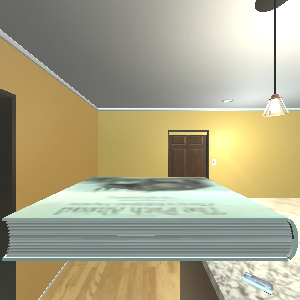
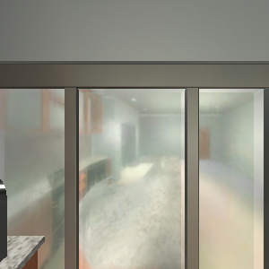

# Verified AI2-THOR setup on Windows through WSLg

## Status

This route was verified on 2026-08-09 with AI2-THOR 5.0.0, Ubuntu 22.04.5 LTS on WSL2, Python 3.10.12, and hardware-accelerated WSLg rendering on an AMD Radeon 780M.

Native Windows is not the verified route. The [official requirements](https://ai2thor.allenai.org/ithor/documentation/) list macOS and Ubuntu, while the upstream [Windows enablement PR #1192](https://github.com/allenai/ai2thor/pull/1192) remains open. WSLg is used to stay on the documented Ubuntu platform while retaining Windows as the host.

## Install the WSL environment

Run from an elevated Windows PowerShell if Ubuntu 22.04 is not installed:

```powershell
wsl --install --distribution Ubuntu-22.04 --no-launch
```

Create the dedicated user and install the recorded system dependencies:

```powershell
wsl --distribution Ubuntu-22.04 --user root -- useradd --create-home --shell /bin/bash research
wsl --distribution Ubuntu-22.04 --user root -- bash -lc "apt-get update && grep -v '^#' /mnt/d/path/to/embodied-memory-thor/environments/ai2thor-wsl-apt.txt | xargs apt-get install -y"
```

Restart WSL once after installing a new distribution, then verify that WSLg is not using software rendering:

```powershell
wsl --shutdown
wsl --distribution Ubuntu-22.04 --user research -- glxinfo -B
```

The verified output contained all of the following:

```text
direct rendering: Yes
Device: D3D12 (AMD Radeon 780M Graphics)
Accelerated: yes
OpenGL renderer string: D3D12 (AMD Radeon 780M Graphics)
```

Create an isolated Python environment inside the Linux filesystem:

```powershell
wsl --distribution Ubuntu-22.04 --user research -- bash -lc "python3 -m venv ~/embodied-memory-thor-runtime/.venv"
wsl --distribution Ubuntu-22.04 --user research -- bash -lc "~/embodied-memory-thor-runtime/.venv/bin/python -m pip install --upgrade pip setuptools wheel"
wsl --distribution Ubuntu-22.04 --user research -- bash -lc "~/embodied-memory-thor-runtime/.venv/bin/python -m pip install -r /mnt/d/path/to/embodied-memory-thor/environments/ai2thor-wsl-requirements.txt"
```

The exact Python lock file is an observed working environment, not a claim that every transitive version must remain permanently fixed. Update it only after rerunning the live smoke test.

## Run the live smoke test

From Windows PowerShell, substitute the repository path:

```powershell
wsl --distribution Ubuntu-22.04 --user research -- bash -lc "cd /mnt/d/path/to/embodied-memory-thor && ~/embodied-memory-thor-runtime/.venv/bin/python scripts/smoke_ai2thor.py --scenes FloorPlan1 FloorPlan10"
```

The first controller construction downloaded a 769 MB build into:

```text
~/.ai2thor/releases/thor-Linux64-f0825767cd50d69f666c7f282e54abfe58f1e917
```

Generated full metadata, action JSONL, summaries, and frames are written under `outputs/ai2thor_smoke/<timestamp>/` and intentionally ignored by Git. The script returns zero only when scene startup, real metadata, rotation, movement, a valid object interaction, an intentional failed interaction, visible-observation change, and RGB saving all pass.

## Verified E2 result

| Scene | Objects | Initially visible | Valid interaction | Other checks |
| --- | ---: | ---: | --- | --- |
| FloorPlan1 | 77 | 4 | Picked up a Book | Rotation, movement, visibility change, failed object ID, RGB |
| FloorPlan10 | 67 | 17 | Turned on a CoffeeMachine | Rotation, movement, visibility change, failed object ID, RGB |





The sanitized machine-readable result is in [`evidence/phase2_5_smoke_summary.json`](evidence/phase2_5_smoke_summary.json). This is E2 integration evidence only; it is not a memory/no-memory experiment.

## Known risks

- WSL may warn that a Windows localhost proxy is not mirrored into NAT mode. Direct downloads worked in the verified run. If they do not, consult Microsoft's [WSL networking and auto-proxy guidance](https://learn.microsoft.com/en-us/windows/wsl/networking/) before changing global WSL settings.
- A Unity window may appear unresponsive to mouse input while Python control continues to work; upstream users have documented this behavior in [issue #1158](https://github.com/allenai/ai2thor/issues/1158).
- After a new WSL distribution is installed, `/tmp/.X11-unix/X0` may not appear until `wsl --shutdown` and relaunch.
- The first build download is much larger and slower than subsequent cached launches.
