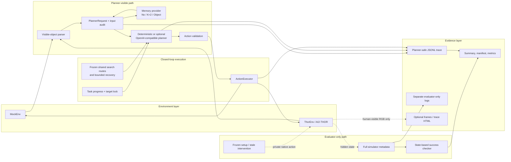

# System Architecture

## Purpose and boundary

Embodied-Memory-THOR is a lightweight research preparation system for studying
memory and context in partially observable embodied tasks. It provides one
closed loop for mock environments and AI2-THOR, three interchangeable memory
providers, deterministic and optional structured-LLM planners, state-based task
evaluation, and auditable traces.

The formal Phase 5 experiment used the deterministic metadata planner. RGB was
retained only for human/debug inspection; it was not consumed by the planner.
The project is not a SOTA embodied policy, a learned visual model, or a physical
robotics system.

## Component map

Solid arrows describe ordinary agent data flow. Dotted arrows mark information
that is either evaluator-only or presentation-only. Hidden global object state,
frozen relocation coordinates, reachable graphs, and candidate outcomes do not
enter `PlannerRequest`.

## One episode lifecycle

1. `ThorEnv` resets a frozen scene and obtains an AI2-THOR event.
2. Evaluator-only setup establishes the prequalified start. Setup actions and
   private identifiers are logged separately and are excluded from agent metrics.
3. The runner builds a safe observation from agent state, inventory, and only
   objects whose metadata says `visible=true`.
4. The selected memory provider stores visible-derived records and retrieves only
   records allowed by that provider's semantics.
5. `PlannerRequest` combines the task stage, safe observation, retrieved records,
   available actions, and ordinary action/failure history. An audit hashes and
   checks the exact request before planning.
6. The planner emits one structured action. Visibility, action-schema, target-lock,
   and memory-provenance checks reject invalid decisions before execution.
7. `ActionExecutor` calls the environment and normalizes simulator rejection or
   exceptions into one result shape.
8. The runner records the post-action safe observation, updates memory and task
   progress, and asks the evaluator to determine success from full state.
9. The trace writer saves aligned observation, planner input, decision, feedback,
   metrics, and hashes. Optional GUI/frame work is outside the planner loop.

## Main modules

| Concern | Main implementation | Responsibility |
| --- | --- | --- |
| Environment contract | `env/base.py` | Common reset, step, observation, evaluator-state, frame, and close interface. |
| Real simulator adapter | `env/thor_env.py` | Lazy AI2-THOR startup, defensive metadata copies, visible-only observation, and failure-aware shutdown. |
| Mock simulator | `env/mock_env.py` | Deterministic partial-observation development and Phase 3 controlled experiments. |
| Action boundary | `actions/action_space.py`, `actions/executor.py` | Structured-action validation and normalized simulator failures. |
| Memory | `phase4/spatial_memory.py` | No memory, exact last-two-observation memory, and persistent visible-history object memory. |
| Planner contract | `phase4/contracts.py` | Safe request/decision schemas, stable digests, and leak/provenance audits. |
| Planners | `phase4/planners.py` | Deterministic task policy plus an optional Responses-API structured planner behind the same request boundary. |
| Episode engine | `phase4/runner.py` | Reset-to-summary loop shared by formal and debug modes. |
| Task/evaluation | `phase4/task.py`, `evaluation/success_checker.py` | Ordered milestones and success verdicts based on environment state. |
| Phase 5 controls | `phase5/search.py`, `target_lock.py`, `memory_navigation.py`, `interventions.py` | Frozen target-independent search, bounded recovery, memory-guided navigation, and private stale relocation. |
| Formal protocol | `phase5/formal_v2.py` and v5 launchers/configs | Public 54-cell manifest, private runtime joins, stop rules, compact rows, and result digests. |
| Analysis | `phase5/formal_analysis_v1.py` | Hash-bound, panel-separated paired descriptive aggregation. |
| Logging | `phase4/trace.py` | JSONL, summary, manifest, optional HTML/frames, and crash-isolated viewer. |

## Memory variants

`no_memory` retains no historical observations or object records. It still has
the same task state, action space, target-independent systematic search, target
lock, and recovery logic as the other variants.

`short_memory_k2` retains exactly the two latest completed safe observations.
The formal tasks deliberately insert enough hidden observations to evict the
initial target, making K=2 a real limited-memory control rather than a renamed
no-memory policy.

`object_memory` keeps persistent per-object records derived from visible
observations: object identity/type and position, last-seen agent pose/horizon,
source observation, step, and freshness status. A failed remembered-viewpoint
check can mark a record `suspected_stale`; retrieval then excludes it and uses
the same fallback as the baselines.

## Information-flow safeguards

- `ThorEnv.get_observation()` filters the object list to visible objects;
  `get_evaluator_state()` is a distinct privileged call.
- Every memory record cites a visible source observation.
- Planner requests are serialized, hashed, and audited for evaluator-only keys,
  hidden objects, canaries, and invalid memory provenance.
- Stale relocation uses a frozen evaluator-only anchor. The native action and
  destination live in separate private logs/registries.
- Public manifests contain opaque configuration IDs and action-only route
  digests, never start poses, target/support coordinates, or reachable graphs.
- Formal output disables GUI, images, and evaluator debug. Presentation output
  cannot change planner semantics.

## Reproducibility design

The formal matrix binds one clean pushed Git revision, exact configuration and
variant order, controller parameters, 2048-action limit, route/policy digests,
required metric schema, private registry joins, and a fresh output directory.
Integrity failures stop and invalidate the entire partial matrix; rows cannot be
resumed or selectively reused. The accepted v5 result completed all 54 cells and
was subsequently hash-frozen before analysis.

For setup and result details, see [AI2-THOR WSL setup](ai2thor_wsl_setup.md),
[the Phase 5 protocol](phase5_experiment_protocol.md), and
[the formal results](phase5_formal_results.md).
